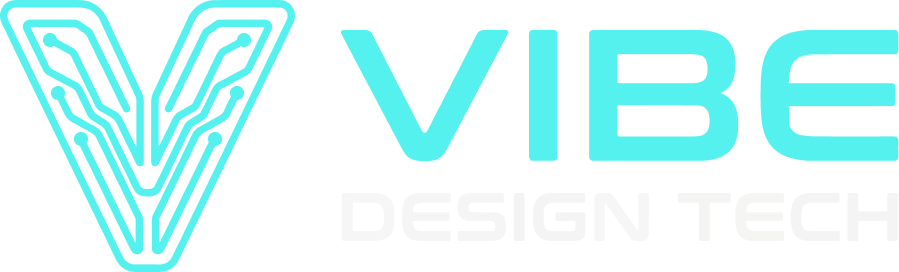

# VIBE Design Tech

> **Design de alto impacto com a velocidade da inteligência artificial.**  
> Presença própria para profissionais de Saúde e Fitness que querem parar de depender apenas de audiência alugada no Instagram.



---

## ⚡ Sobre o Projeto

A **VIBE Design Tech** transforma perfis em redes sociais em ativos proprietários de alta conversão: sites velozes, funis que qualificam leads e sistemas sob medida com integrações automáticas (WhatsApp, n8n, CRM).

### Principais Funcionalidades:
- **Hero Interativo com V-Glass em 3D**: Renderizado via Three.js com suporte a rotação e visual translúcido.
- **Seção "O Problema"**: Demonstração de dor de mercado com cards em hover interativo com brilho neon.
- **Seção "Como Funciona" (Tiers)**: Apresentação das 3 camadas de serviço (Site Base, Site + Personalização, App / Sistema Completo) com botão para visualização de modelo real.
- **Antes & Depois (Cases)**: Comparativo lado a lado de link na bio genérico vs. página institucional de alta conversão.
- **Tabela de Planos**: Comparativo de planos com links dinâmicos de atendimento via WhatsApp API.
- **Seção Sobre**: Apresentação dos fundadores com fotos, bio e liderança técnica e comercial.
- **Final CTA & Integrações**: Botões de ação direta para WhatsApp e Instagram oficial, com responsividade mobile fluida.

---

## 🛠️ Tecnologias Utilizadas

- **Framework**: [Next.js 14](https://nextjs.org/) (App Router)
- **Linguagem**: [TypeScript](https://www.typescriptlang.org/)
- **Estilização**: [Tailwind CSS](https://tailwindcss.com/)
- **3D / Gráficos**: [Three.js](https://threejs.org/)
- **Tipografia Local**: Big Shoulders Display, Space Mono e Inter

---

## 🚀 Como Executar Localmente

### 1. Clonar o Repositório
```bash
git clone https://github.com/danielmilkdesign/vibe-design-tech.git
cd vibe-design-tech
```

### 2. Instalar Dependências
```bash
npm install
```

### 3. Rodar em Ambiente de Desenvolvimento
```bash
npm run dev
```
Abra [http://localhost:3000](http://localhost:3000) no seu navegador para ver o resultado.

### 4. Compilar para Produção
```bash
npm run build
npm run start
```

---

## 🌐 Deploy na Vercel

O projeto está 100% pronto para deploy na [Vercel](https://vercel.com/):
1. Conecte sua conta do GitHub na Vercel.
2. Importe o repositório `vibe-design-tech`.
3. Clique em **Deploy** (as configurações do Next.js são detectadas automaticamente).

---

## 📬 Contato

- **WhatsApp**: [+55 92 99202-7059](https://wa.me/5592992027059)
- **Instagram**: [@vibedesigntech](https://instagram.com/vibedesigntech)
- **Copyright**: © 2026 VIBE Design Tech. Todos os direitos reservados.
